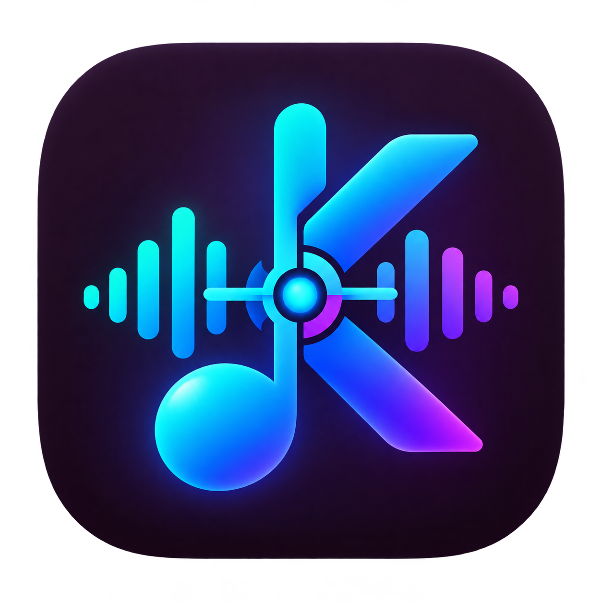

<div align="center">
  
  <h1>Karaoke Sync Studio</h1>
  <p><strong>Настольная студия для создания караоке, точных таймкодов и Full HD-видео из аудиозаписи.</strong></p>
  <p><a href="README.en.md">English version</a> · <a href="https://github.com/Frommer-droid/karasync-studio/releases/latest">Последний релиз</a></p>
</div>

Karaoke Sync Studio распознаёт вокал через Gemini AI, сопоставляет результат с эталонным текстом песни и позволяет вручную довести синхронизацию до кадра. Проект работает как локальное веб-приложение и как Windows-приложение на Electron.

## Возможности

- распознавание слов и таймкодов из оригинального трека или отдельной вокальной дорожки;
- выравнивание с эталонным текстом с сохранением строк, регистра и пунктуации;
- подробная волна чистого вокала поверх временной шкалы оригинального трека,
  перетаскивание маркеров начала слов, удаление ошибочного слова через его
  контекстное меню и общий сдвиг меток на 50/100 мс;
- переход по словам из плеера и точная корректировка их начала; выбранное
  слово играет до следующей метки и возвращается к своему началу. Одиночное тире
  прикрепляется к предыдущему слову и не получает самостоятельный таймкод;
- автоматическое слежение списка слов за текущей строкой во время воспроизведения;
- кнопки Undo/Redo для правок слов и меток;
- двухстрочное караоке-превью с настройкой шрифтов, цветов, позиций и брендинга;
- фоновые видео, заставки в начале и конце, полноэкранный просмотр;
- экспорт субтитров LRC, SRT, VTT и данных JSON;
- создание Full HD-видео с быстрым 20-секундным тестовым режимом;
- сохранение проектов, аудио и пресетов оформления локально;
- единый фирменный знак в интерфейсе, окне, панели задач и установщике;
- версия и заметки о выпуске в меню «О программе» настольного приложения.

## Требования

- Windows 10/11 для настольной сборки;
- Node.js 20 или новее и npm;
- ключ Gemini API для распознавания;
- современный Chromium-браузер для режима разработки.

## Установка в Windows

Скачайте установщик со [страницы последней версии](https://github.com/Frommer-droid/karasync-studio/releases/latest), запустите его и следуйте шагам мастера. По умолчанию программа устанавливается в `D:\Apps\Караоке Синк Студио`, а на компьютере без диска D — в `C:\Apps\Караоке Синк Студио`. Готовое приложение не требует Node.js.

Выпуск 0.6.1 использует новый установщик Inno Setup. Если у вас установлена версия 0.6.0 через NSIS, удалите её через список установленных приложений Windows после перехода на новую версию, чтобы не оставлять два отдельных установленных экземпляра. Локальные проекты и настройки Electron хранятся вне папки программы.

## Запуск из исходников

```powershell
npm install
Copy-Item .env.example .env
npm run dev
```

После копирования укажите `GEMINI_API_KEY` в локальном `.env` и откройте `http://127.0.0.1:3000`.

Ключ также можно ввести непосредственно в интерфейсе. Он сохраняется только в локальном хранилище приложения и передаётся серверу вместе с запросом распознавания.

## Основной сценарий

1. Загрузите оригинальную песню.
2. При необходимости добавьте чистую вокальную дорожку и эталонный текст.
3. Запустите распознавание и проверьте строки в редакторе синхронизации.
4. Настройте оформление и проверьте короткий тестовый фрагмент.
5. Экспортируйте субтитры или готовое видео.

## Разработка и проверки

```powershell
npm run lint
$testFiles = @(rg --files -g '*.test.ts')
node --import tsx --test $testFiles
npm run build
```

Запуск Electron поверх уже работающего dev-сервера:

```powershell
$env:ELECTRON_START_URL = 'http://127.0.0.1:3000'
npm run electron
```

## Сборка Windows

```powershell
npm run dist:electron
```

Команда создаёт распакованное приложение в папке `Karaoke-Sync-Studio-<версия>\win-unpacked` и установщик Inno Setup на рабочем столе текущего пользователя. Для сборки нужен Inno Setup 6.

Подробная архитектура, хранение данных и релизный процесс описаны в [DEVELOPER.md](DEVELOPER.md).

## Технологии

| Область | Стек |
|---|---|
| Интерфейс | React 19, TypeScript, Tailwind CSS 4, Lucide |
| Сервер | Express, Gemini API |
| Аудио | WaveSurfer.js, Web Audio API |
| Видео | Canvas, WebCodecs, mp4box, mp4-muxer |
| Desktop | Electron 42, electron-builder, Inno Setup 6 |
| Тесты | Node.js test runner, TypeScript |

## Данные и безопасность

- `.env`, ключи API, локальные проекты и пользовательские медиа не входят в Git;
- проекты и настройки сохраняются в `localStorage`, аудио и изображения — в IndexedDB;
- настольное приложение открывает внешние ссылки в системном браузере и использует изолированный preload-мост;
- перед публикацией проверяйте, что в Git нет секретов и релизных бинарников.

## Лицензия

Исходный код распространяется по [лицензии MIT](LICENSE). Установщик Windows
публикуется отдельным asset в GitHub Release.
